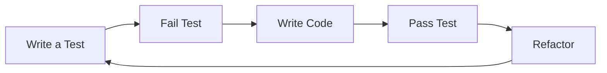
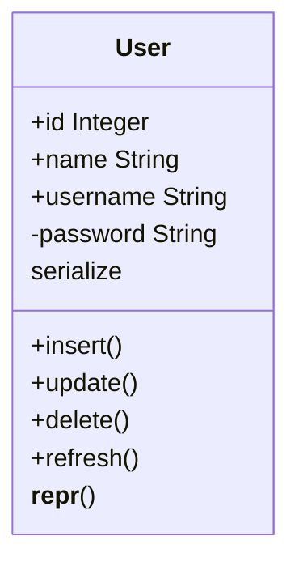
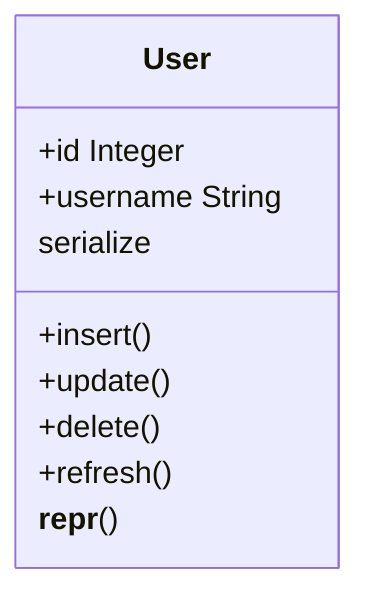
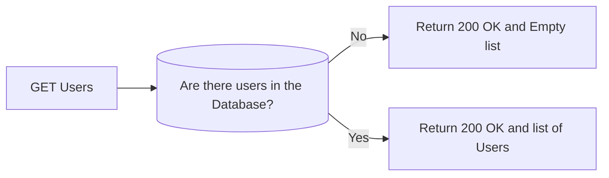
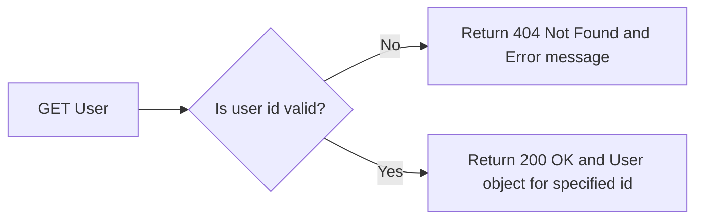
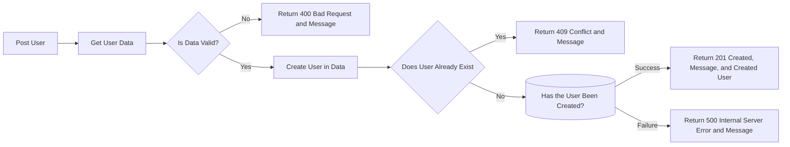
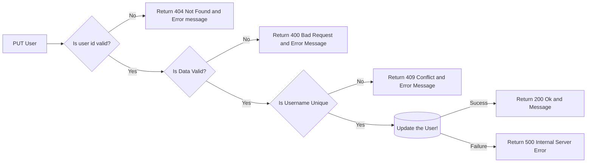
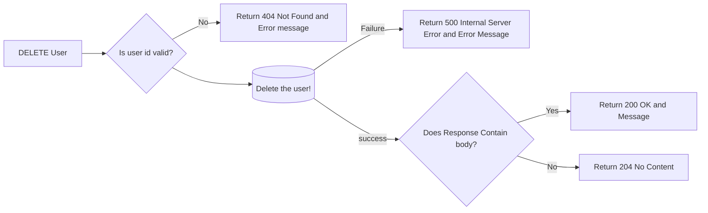

# TDD Simplified

## The Test Driven Development Cycle



## User Model

### Complete User Model

A representation of the complete User model that we will have after refactoring the code



### A Simple User model

We are going to start with a simple User Model so that we can full grasp and appreciate the TDD workflow



## End Points Sequence Diagrams  

### Get  Users: GET `/users`



## Get a User: GET `/users/<user_id>`



### Create a User: POST `/users`



### Update a User: PUT `/users`



### Delete  a User: DELETE `/users/<user_id>`



## Important to know

### how to get json data from the request object

```json
{ "username": "Arthur"}
```

1. [**json**](https://flask.palletsprojects.com/en/2.1.x/api/?highlight=request#flask.Request.json) returns a `python dictionary` with `key-value` pairs

   - The parsed JSON data if [`mimetype`](https://flask.palletsprojects.com/en/2.1.x/api/?highlight=request#flask.Request.mimetype) indicates JSON (`*application/json`)[`is_json`](https://flask.palletsprojects.com/en/2.1.x/api/?highlight=request#flask.Request.is_json)).

   - Calls [`get_json()`](https://flask.palletsprojects.com/en/2.1.x/api/?highlight=request#flask.Request.get_json) with default arguments.

   - If the request content type is not `application/json`, this will raise a 400 Bad Request error.

     ```python
     data = request.json
     username = data["username"]
     ```

2. [**get_json**(*force=False*, *silent=False*, *cache=True*)](https://flask.palletsprojects.com/en/2.1.x/api/?highlight=request#flask.Request.get_json) returns a `dict` with `key-value` pairs

     - Raises a 400 error if the content type is incorrect.

     - **force** ([*bool*](https://docs.python.org/3/library/functions.html#bool)) –   Ignore the mimetype and always try to parse JSON.

       ```python
       data = request.get_json(force=True)
       ```

3. [flask.json.**loads**(*s*, *app=None*, ***kwargs*)](https://flask.palletsprojects.com/en/2.1.x/api/?highlight=request#flask.json.loads)

     - Serialize an object to a string of JSON.

       ```python
       data = json.loads(request.data.decode())
       ```

## How to convert to  python objects  to JSON  String

1. [**flask.json.jsonify**](https://flask.palletsprojects.com/en/2.1.x/api/?highlight=request#flask.json.jsonify)

   - Serialize data to JSON and wrap it in a Response with the `application/json` mimetype

     ```python
     jsonify({"username": "Arthur"})
     ```

3. [flask.json.**dumps**(*obj*, *app=None*, ***kwargs*)](https://flask.palletsprojects.com/en/2.1.x/api/?highlight=request#flask.json.dumps)

   - Serialize an object to a string of JSON.

     ```python
     user_dict = { "username": "Arthur" }
     json_data = json.dumps(user_dict)
     ```

## Dependecies

- [Flask](https://flask.palletsprojects.com/en/2.1.x/)
- [Flask-SQLAlchemy](https://flask-sqlalchemy.palletsprojects.com/en/2.x/quickstart/)
- [Flask-Migrate](https://flask-migrate.readthedocs.io/en/latest/)
- [Pytest](https://docs.pytest.org/en/7.1.x/getting-started.html)
- [autopep8](https://github.com/hhatto/autopep8)

## How to set up and run the project

- Create and Activate a Python virtual environment

- Install requirements `pip install -r requirements.txt`
- Set environment variables specified in the env_sample.txt
  - DATABASE_URL - Production
  - DEV_DATABASE_URL - Development
  - TEST_DATABASE_URL - Testing
- Update the migrations
  - `flask db upgrade`
- Run the project
  - `python -m run`

### How to Create and Activate a Python virtual Environment

- Open your terminal at the root of the project
- create a virtual environment `python -m venv env`
- Activate the virtual environment
  - for windows `env\Scripts\activate`
  - for linux\macOS `source env/bin/activate`
- Deactivate the virtual environment
  - `deactivate`

## How to run tests

- Activate the virtual environment
- SET the `TEST_DATABASE_URL` environment variable
- `pytest tests`

## Refrences

- [SQLAlchemy Documentation](https://docs.sqlalchemy.org/en/14/index.html)
- [Flask Documentation](https://flask.palletsprojects.com/en/2.1.x/)
- [HTTP responses status codes](https://developer.mozilla.org/en-US/docs/Web/HTTP/Status)
- [How to Get and Parse HTTP POST Body in Flask - JSON and Form Data](https://stackabuse.com/how-to-get-and-parse-http-post-body-in-flask-json-and-form-data/)
- [How to Process Incoming Request Data in Flask](https://www.digitalocean.com/community/tutorials/processing-incoming-request-data-in-flask)
- [Running alembic migrations in flask tests](https://blog.k-nut.eu/flask-alembic-test)
